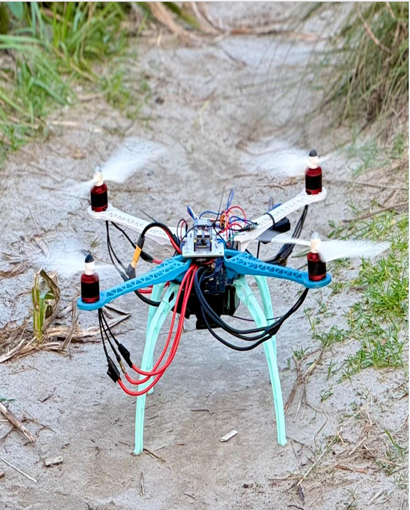
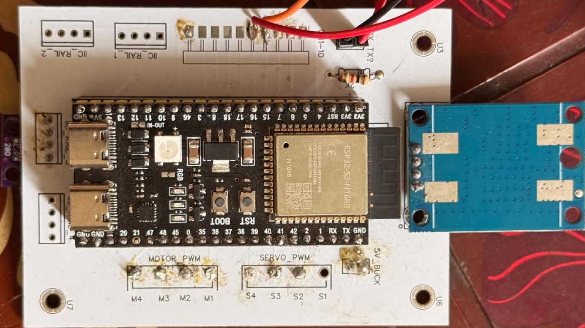
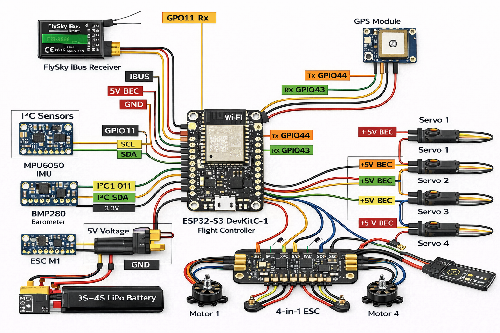
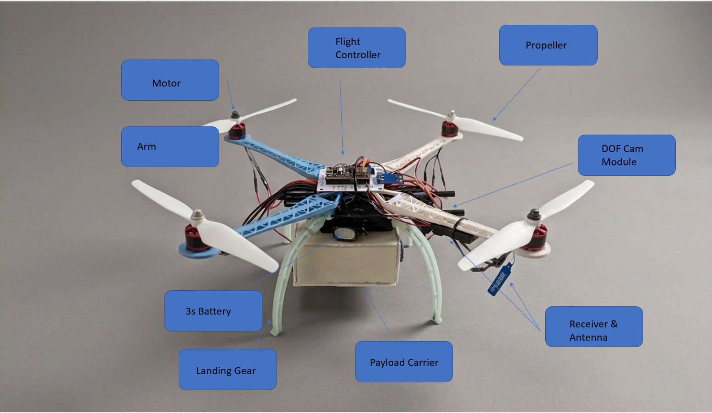

<div align="center">

# Project Falcon
### ESP32-Based Quadcopter Prototype

Project Falcon is a custom-built ESP32 quadcopter prototype featuring a custom flight-controller PCB, MPU6500 IMU, Neo-6M GPS, 4-in-1 ESC, PID-based stabilization, and FlySky RC control. The prototype has achieved successful lift-off and repeated flight testing, while stable hover and further controller tuning remain under active development.




</div>

---


## Overview

**Project Falcon** is an ESP32-based quadcopter prototype developed as an undergraduate embedded systems project. It was built to gain hands-on, end-to-end experience in UAV development — spanning custom PCB design, sensor integration, motor and ESC control, wireless RC communication, and closed-loop flight stabilization.

Rather than using an off-the-shelf flight controller, the project implements the control firmware directly on an ESP32, paired with a custom-designed PCB that integrates power distribution and signal routing for the sensors, ESC, and servo.

The prototype has reached the **flight-testing stage**: it lifts off and responds to control input, while stable hover and precise attitude control remain active areas of development.

---

## Objectives

- Design and fabricate a custom PCB to serve as the core of the flight controller and power system.
- Integrate an IMU and GPS module for orientation and position awareness.
- Implement a PID-based control loop on the ESP32 for flight stabilization.
- Interface BLDC motors via a 4-in-1 ESC for propulsion.
- Establish reliable wireless control using an FS-i6/FS-iA6 RC link.
- Implement a servo-actuated payload deployment mechanism.
- Validate the system through iterative flight testing.

---

## Project Status

| Milestone | Status |
|---|---|
| Custom PCB design & fabrication | Completed |
| Hardware integration (sensors, ESC, servo) | Completed |
| Flight controller firmware (ESP32) | Completed |
| Sensor communication (IMU, GPS) | Completed |
| Motor synchronization | Completed |
| Lift-off | Achieved |
| Flight testing | Completed (multiple sessions) |
| Stable hover / precise attitude control | In progress |
| PID tuning & IMU calibration refinement | In progress |

This project is best described as a **working, flight-tested prototype** rather than a finished product — the core hardware and firmware pipeline is functional, and stabilization performance is being iteratively improved.

---

## Key Features

- ESP32-based embedded flight controller
- Custom-designed PCB for power and signal integration
- MPU6500 6-axis IMU for inertial sensing
- Neo-6M GPS module for position data
- 4-in-1 ESC driving four BLDC motors
- FlySky FS-i6 transmitter / FS-iA6 receiver for wireless control
- PID-based stabilization loop
- Servo-actuated payload deployment mechanism
- Field-tested through repeated flight trials

---

## System Specifications

| Parameter | Detail |
|---|---|
| Flight controller MCU | ESP32 |
| Frame configuration | Quadcopter |
| Motors | 4 × A2212 BLDC |
| ESC | 4-in-1 electronic speed controller |
| IMU | MPU6500 (6-axis: accelerometer + gyroscope) |
| GPS | Neo-6M |
| RC link | FlySky FS-i6 (TX) / FS-iA6 (RX) |
| Power source | 2200 mAh 3S Li-Po |
| Auxiliary actuator | Servo motor (payload deployment) |
| Control method | PID (proportional-integral-derivative) |
| Firmware language | Embedded C++ (Arduino framework) |

*Values above reflect the components used in the prototype build, not independently benchmarked performance specifications.*

---

## Hardware Components

| Component | Specification | Function |
|---|---|---|
| ESP32 | Dual-core MCU, Wi-Fi/BT capable | Main flight controller; runs sensor read, PID, and motor control loop |
| MPU6500 | 6-axis IMU (accel + gyro) | Provides orientation/motion data for stabilization |
| Neo-6M GPS | GPS receiver module | Supplies positional data |
| A2212 BLDC Motors (×4) | Brushless DC motor | Generates thrust via propellers |
| 4-in-1 ESC | Combined electronic speed controller | Converts control signals into motor drive signals |
| FlySky FS-iA6 Receiver | RC receiver | Receives pilot commands from the FS-i6 transmitter |
| 2200 mAh 3S Li-Po Battery | Lithium-polymer battery pack | Powers the motors, ESC, and onboard electronics |
| Custom PCB | Multi-signal integration board | Houses flight controller wiring, power distribution, and sensor connections |
| Servo Motor | Standard RC servo | Actuates the payload deployment mechanism |

---

## Software & Development Tools

- **Arduino IDE** — firmware development environment
- **Embedded C++** — firmware implementation language
- **ESP32 Arduino Core** — hardware abstraction and peripheral drivers
- **PID control algorithm** — implemented in firmware for stabilization

---

## System Architecture

```text
                 FlySky Transmitter (TX)
                          |
                          v
                 FlySky Receiver (RX)
                          |
                          v
              +------------------------+
              |   ESP32 Flight         |
              |   Controller           |
              +------------------------+
                 |        |        |
        +--------+        |        +--------+
        v                 v                 v
    MPU6500            Neo-6M             Servo
   (IMU data)          (GPS data)       (payload)
                          |
                          v
                    4-in-1 ESC
                          |
                          v
                     BLDC Motors
                          |
                          v
                      Propellers
```

---

## Working Principle

1. The **FlySky receiver** forwards pilot commands to the ESP32.
2. The **MPU6500 IMU** continuously provides raw inertial data (acceleration and angular rate).
3. The **ESP32 firmware** processes this sensor data and receiver input through a **PID control loop** to compute the corrective output needed to stabilize the aircraft.
4. The ESP32 sends the resulting control signals to the **4-in-1 ESC**.
5. The ESC regulates the drive signal to each of the four **BLDC motors** accordingly.
6. The motors generate differential thrust across the propellers to control the aircraft's attitude and lift.
7. The **Neo-6M GPS** supplies positional data to the controller.
8. On command, the **servo motor** actuates the payload deployment mechanism.

---

## Flight Control (PID)

The stabilization pipeline follows a standard closed-loop structure:

```text
Receiver Input -> ESP32 -> IMU Data -> PID Controller -> ESC -> Motor Output
```

A PID (proportional–integral–derivative) control approach is used to compute correction values for the aircraft's **roll**, **pitch**, and **yaw** axes based on IMU feedback and receiver input, adjusting individual motor speeds to counteract deviation from the desired attitude.

At the current stage of development:

- The PID loop is functional and drives motor response to sensor input.
- Gain tuning is not yet finalized — the aircraft does not yet achieve stable, sustained hover.
- Further refinement of PID gains and IMU calibration is required to improve stability and reduce oscillation.

This reflects the current tuning state accurately rather than presenting the controller as fully optimized.

---

## Custom PCB

<p align="center">
  
</p>

The custom PCB integrates power distribution and signal routing between the ESP32, IMU, GPS, ESC, and servo, replacing what would otherwise be a breadboard or perfboard wiring harness. Designing this board was a core deliverable of the project, requiring layout decisions around power traces, noise isolation for the IMU, and connector placement for field serviceability.

---

## Circuit / Pinout

<p align="center">
  
</p>

---

## Prototype

<p align="center">
  
</p>

---

## Flight Demonstration

<p align="center">
  
</p>

<p align="center"><em>Prototype flight test — lift-off and control response evaluation.</em></p>

---

## Experimental Results

**Successfully demonstrated:**

- Custom PCB integration into a functioning system
- Reliable communication with IMU and GPS sensors
- Synchronized operation of all four BLDC motors
- Successful lift-off
- End-to-end firmware execution (sensor read → PID → ESC → motor)
- Servo-based payload deployment mechanism
- Multiple flight test sessions completed

**Remaining engineering work:**

- Achieving stable, sustained hover
- Further PID gain tuning
- Improved IMU calibration
- Reduction of mechanical vibration affecting sensor readings
- More precise flight-path control

These are treated as the next iteration of development rather than as project shortcomings — the prototype has validated the core hardware and firmware architecture, and remaining work is concentrated in control-loop tuning.

---

## Engineering Challenges

| Challenge | Description |
|---|---|
| PID tuning | Finding stable gain values for roll/pitch/yaw without inducing oscillation or overshoot |
| Sensor calibration | Keeping MPU6500 readings accurate and drift-free under vibration and thermal changes |
| Mechanical vibration | Motor and frame vibration introduces noise into IMU readings, affecting control accuracy |
| Motor synchronization | Ensuring all four BLDC motors respond uniformly to ESC commands |
| Power management | Supplying stable power to sensors and logic while driving high-current motor loads |
| Flight stabilization | Translating sensor and control-loop output into smooth, predictable flight behavior |
| Embedded debugging | Diagnosing firmware and hardware issues in a real-time, resource-constrained embedded environment |

---
## Engineering Contribution

The main contribution of Project Falcon was the development of a low-cost, custom ESP32-based flight-control platform rather than relying on a commercial flight controller.

The project involved:

- Designing and fabricating a custom flight-controller PCB
- Developing embedded firmware for sensor acquisition and motor control
- Integrating MPU6500 inertial sensing with a real-time control loop
- Implementing PID-based roll, pitch, and yaw stabilization
- Interfacing an RC receiver with the ESP32
- Generating control signals for a 4-in-1 ESC
- Integrating GPS and a servo-actuated payload mechanism
- Validating the complete system through physical flight testing

The project emphasizes hands-on embedded systems engineering, control systems, PCB design, and iterative experimental validation.

## Lessons Learned

This project provided direct, practical experience in:

- Embedded systems development on the ESP32 platform
- PCB design, layout, and fabrication
- Flight control theory and PID-based control loops
- Sensor integration and calibration
- Power electronics for motor-driven systems
- End-to-end UAV system development
- Hardware debugging and iterative testing
## Repository Structure
 
```text
Project-Falcon/
│
├── README.md
├── LICENSE
│
├── images/
│   ├── cover.png
│   ├── flight-test.gif
│   └── pcb_board.jpg 
│
├── pinout.png
├── prototype.png
│
└── src/
    └── Flight_Controller.ino
```
 
---
 
## Future Development
 
**Flight Control**
- [ ] Improved PID controller tuning
- [ ] Better IMU calibration routines
- [ ] Altitude hold mode
**Navigation**
- [ ] Autonomous navigation
- [ ] Optical flow sensor for position hold
- [ ] Obstacle avoidance
**Hardware & Payload**
- [ ] FPV camera integration
**Intelligent Systems**
- [ ] Mobile monitoring application
- [ ] AI-assisted flight stabilization
---
 
## Author
 
**Ruhit Mondal**
B.Sc. in Electrical & Electronic Engineering (EEE)
Ahsanullah University of Science and Technology (AUST)
Bangladesh
 
---
 
## Support
 
If this project is useful or interesting to you, consider starring the repository — it helps others find it.
 
---

